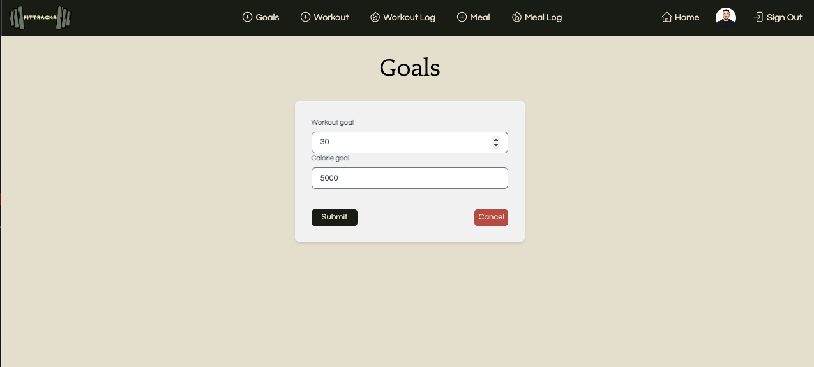

# 
  

  ## ℹ️ Description
  Welcome to Fittrackr :muscle:! Fittrrackr is a fitness tracking app that monitors your meals and workouts by calculating both caloric intake and loss. It helps users stay on top of their health goals by providing real-time calorie counts and allowing them to set personalized calorie and workout goals.

  

  
  ### [CLICK TO DEMO](https://google.com/)

  # Meet The Team
  
  
  

  

  ## 📸  Screenshots
  | Description       | Screenshot                                                |
  |:-----------------:|-----------------------------------------------------------|
  | **Landing Page**  |                |
  | **Sign Up**       |                          |
  | **Sign In**       |                          |
  | **Dashboard**     |                     |
  | **User Profile**  |                   |
  | **Set Goals**     |                      |
  | **WorkOut Log**  |                   |
  | **WorkOut Form**|                  |
  | **WorkOut Details**|         |
  | **Meal Log**|                              |
  | **Meal Form**|                           |
  | **Meal Details**|                  |

  ## 🚀 Get Started
  Ready to get Fit? Check out Fittrackr now! :muscle:  
  [Fittrackr](Insert Deployed App)  
  
  Or, Peek Behind the Scenes of Our Planning Journey! :pencil2::notebook:  
  [Fittrackr Trello board](https://trello.com/invite/b/66e368b8eca7f8370b68a4ff/ATTIe655613435427517da21df36d6c0aebcB98F5860/fittrakr)

  ## 🖥️ Technologies Used
  
  
  
  
  
   
  
  
  
  
  

  ## 🔮 Future Plans

- **Incorporate Meals API**
  - Ability to search food to pull calories from API
  - Ability to view additional workout details from API
  - Ability to share goals with friends, and comment on each others’ goals
  - Review carousel to utilize real reviews left about app
- **Reset Password Feature**
  - Enables users who are logged out to reset their password via email verification process